# Лаборатория изоляции

Воссоздайте многоэтапное вторжение, проанализировав сетевой трафик, память и артефакты вредоносного ПО с помощью Wireshark, Volatility и VirusTotal, а затем сопоставьте полученные данные с результатами теста MITRE ATT&CK.

## Сценарий
Центр мониторинга безопасности TechNova Systems обнаружил подозрительный исходящий трафик с общедоступного сервера IIS в своей облачной платформе — активность, указывающая на проникновение через веб-оболочку и скрытые соединения с неизвестным хостом.

В качестве эксперта-криминалиста у вас есть три важных артефакта: файл PCAP, содержащий первоначальный трафик, полный образ памяти сервера и образец вредоносного ПО, извлеченный с диска. Восстановите вторжение и все действия злоумышленника, чтобы TechNova могла локализовать взлом и укрепить свою защиту.

## Отчёты по инцидентам

## Анализ PCAP
| Entity | Value |
|---|---|
| Question 1 | 10.0.2.4 |
| Question 2 | nmap |
| Question 3 | \\10.0.2.15\Documents, \\10.0.2.15\IPC$ |
| Question 4 | shell.aspx |
| Question 5 | 4443 |

Question 1

После того, как злоумышленник засыпал хост IIS множеством разведывательных запросов, он раскрывает их источник. С какого IP-адреса был сгенерирован этот разведывательный трафик?
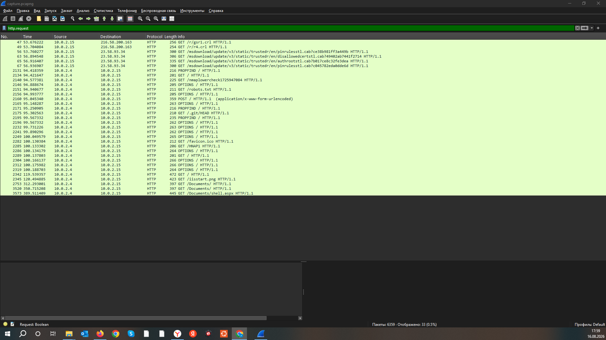

Question 2

Злоумышленник проводит целенаправленное перечисление HTTP-сервисов на хосте IIS. Какой инструмент используется, исходя из заголовков HTTP-запроса?
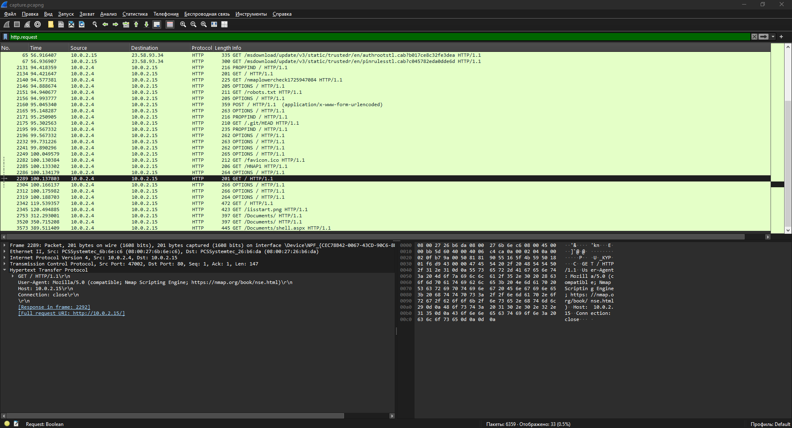

Question 3

При анализе трафика SMB вы обнаруживаете два последовательных запроса Tree Connect, которые предоставляют доступ к первым общим ресурсам, которые злоумышленник проверяет на хосте IIS. К каким двум полным UNC-путям осуществляется доступ?
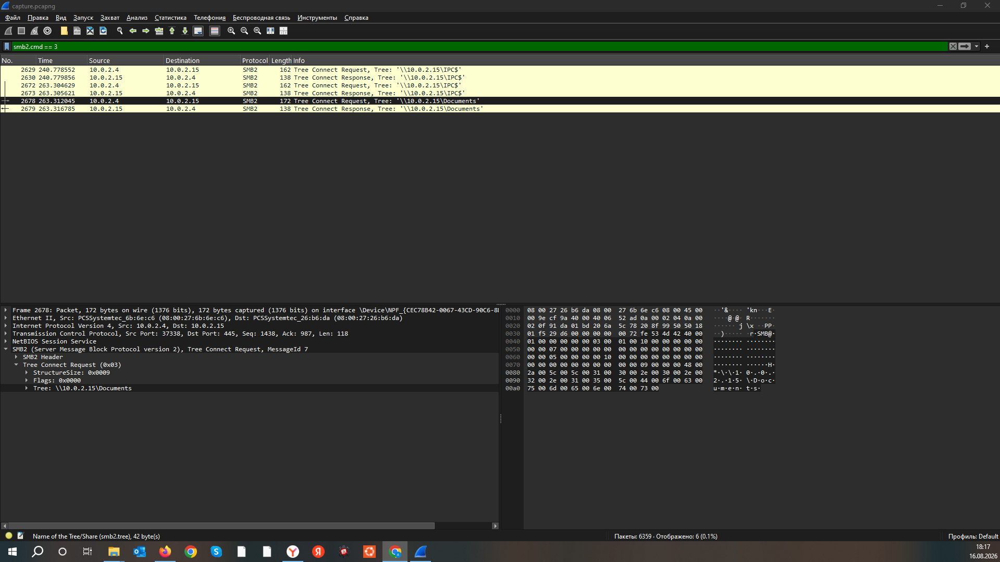

Question 4

Внутри общего ресурса злоумышленник внедряет доступную через Интернет полезную нагрузку, которая позволит удаленно выполнять код. Как называется вредоносный файл, который он загрузил?
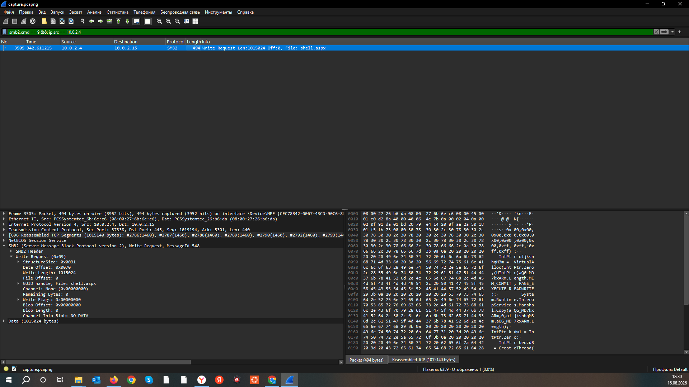

Question 5

Внедренная оболочка обращается к злоумышленнику через необычный, но безопасный для брандмауэра порт. Какой порт прослушивания использовал злоумышленник для обратной оболочки?
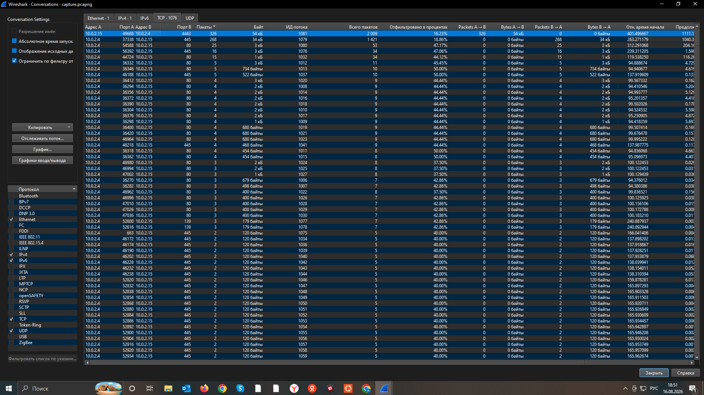

## Анализ дампов памяти
| Entity | Value |
|---|---|
| Question 6 | 0xf80079213000 |
| Question 7 | C:\ProgramData\Microsoft\Windows\Start Menu\Programs\Startup\updatenow.exe |
| Question 8 | w3wp.exe, 4332 |

Question 6

Ваш снимок памяти фиксирует состояние ядра системы непосредственно в системе, предоставляя важный контекст для обнаружения утечки данных. Какой базовый адрес ядра указан в дампе?
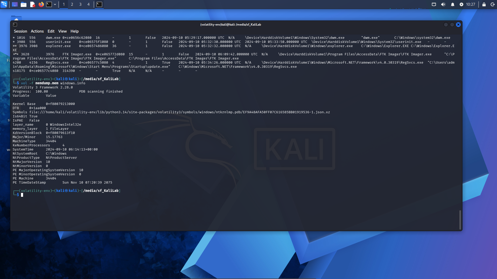

Question 7

Доверенная служба запускает незнакомый исполняемый файл, находящийся вне стандартного стека IIS, сигнализируя о внедрении механизма постоянного присутствия. Каков конечный полный путь этого исполняемого файла на диске?
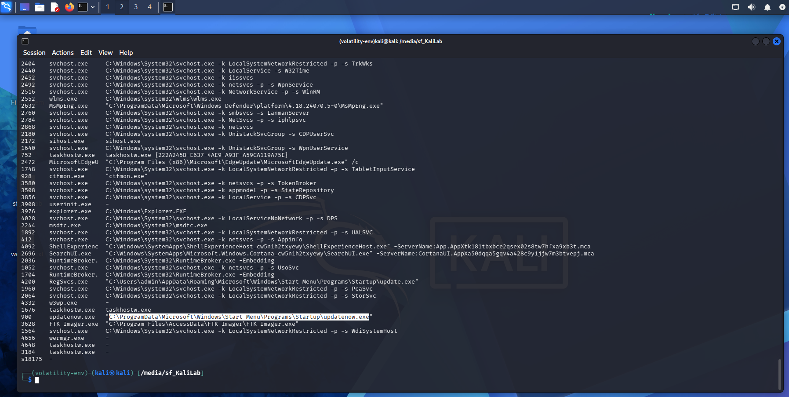

Question 8

Исходящий трафик обратной оболочки обрабатывается встроенным процессом Windows, который также запускает внедренный исполняемый файл. Как называется этот процесс и под каким PID он работает?
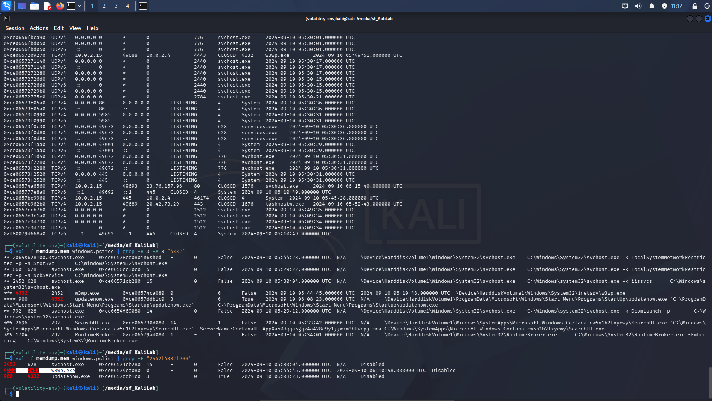

## Malware Sample Analysis
| Entity | Value |
|---|---|
| Question 9 | UPX |
| Question 10 | cp8nl.hyperhost.ua |
| Question 11 | AgentTesla |

Question 9

Статический анализ показывает, что бинарный файл был упакован таким образом, чтобы затруднить анализ. Какой упаковщик использовался для его обфускации?
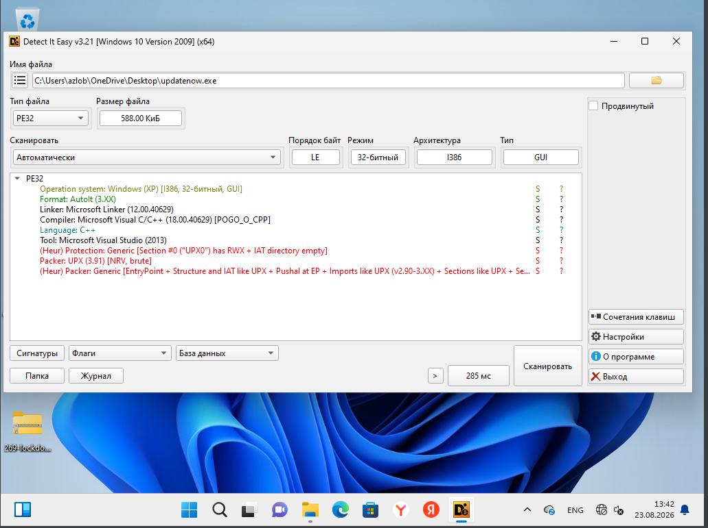

Question 10

Анализ угроз показывает, что вредоносная программа отправляет сигналы на свой управляющий хост. С каким полным доменным именем (FQDN) она связывается?
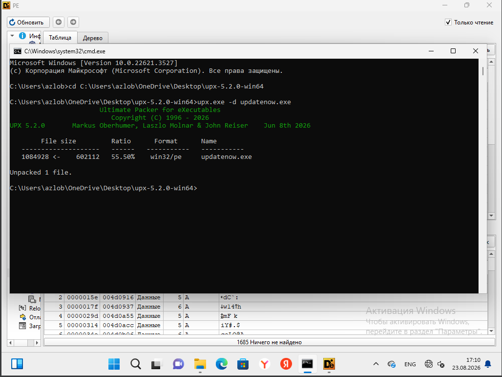
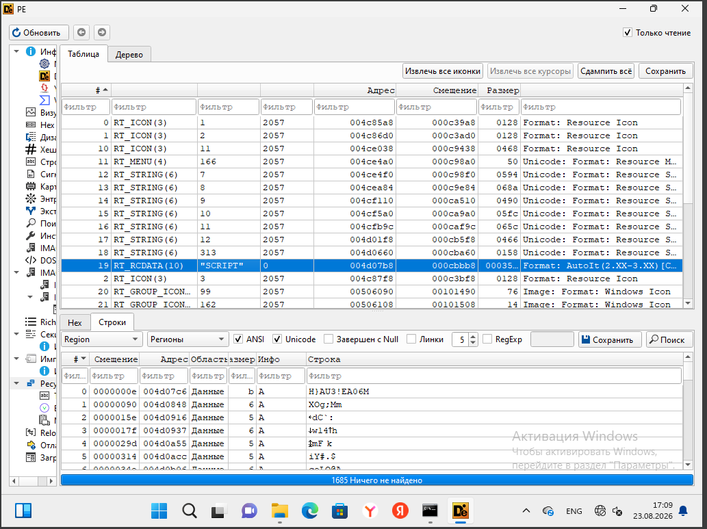
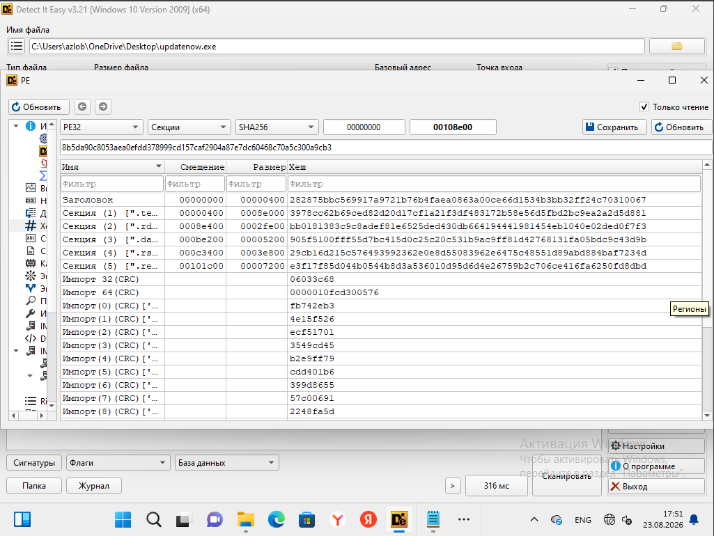
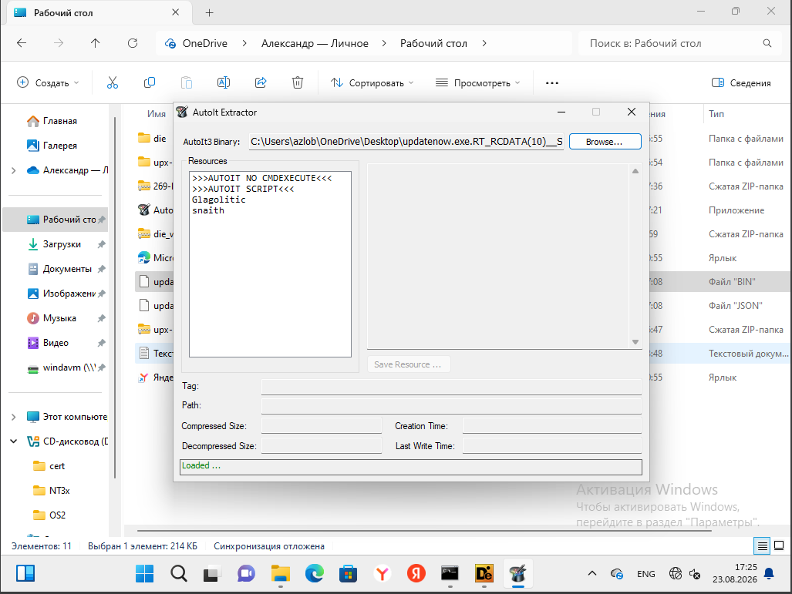
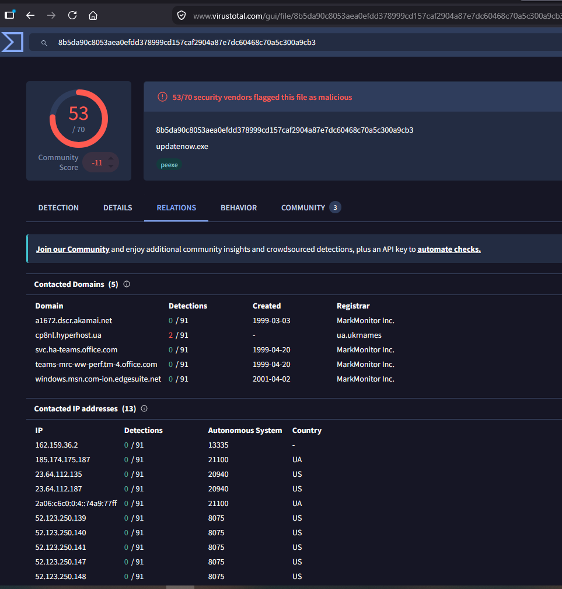

Question 11

В ходе анализа открытых источников полученная информация связывает этот хеш с широко распространенным RAT-программным обеспечением. К какому семейству вредоносных программ относится данный образец?

